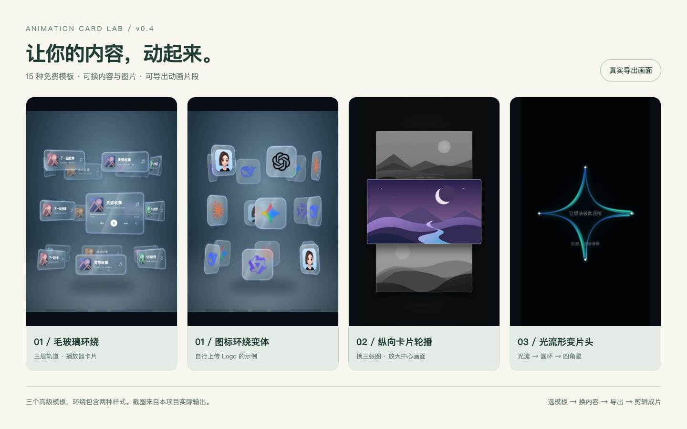
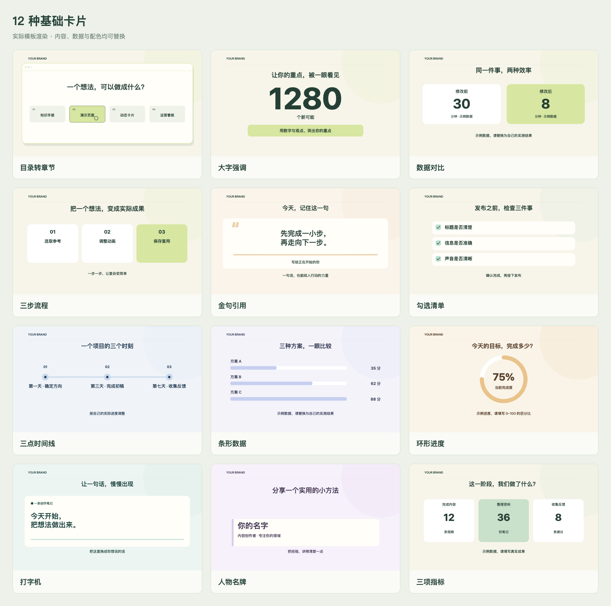
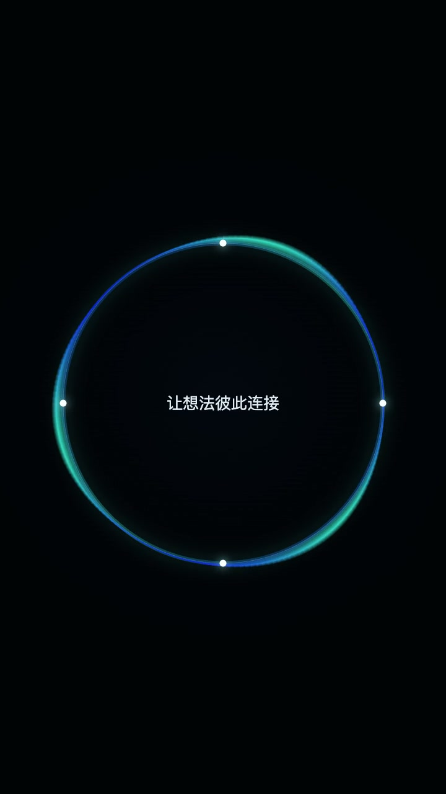
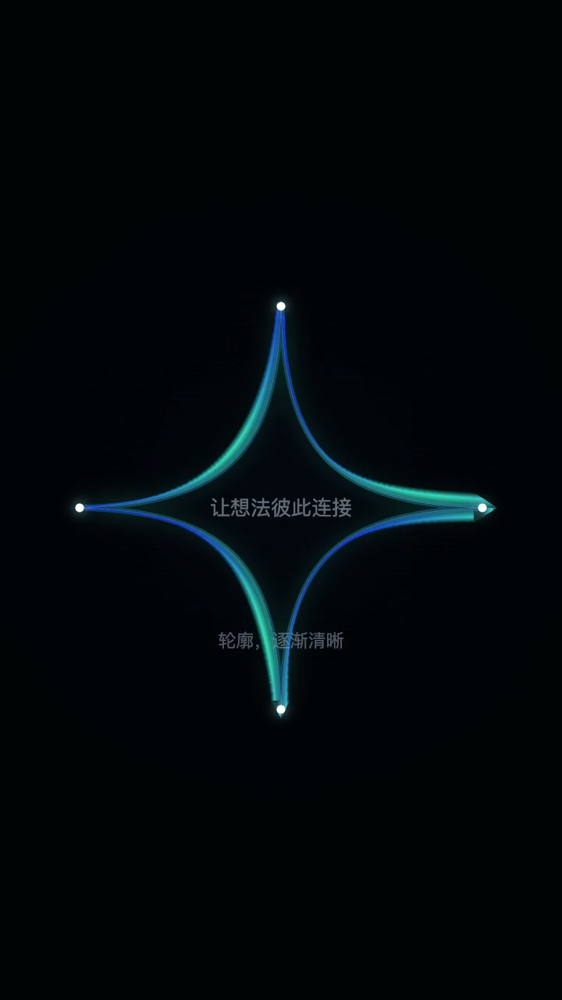
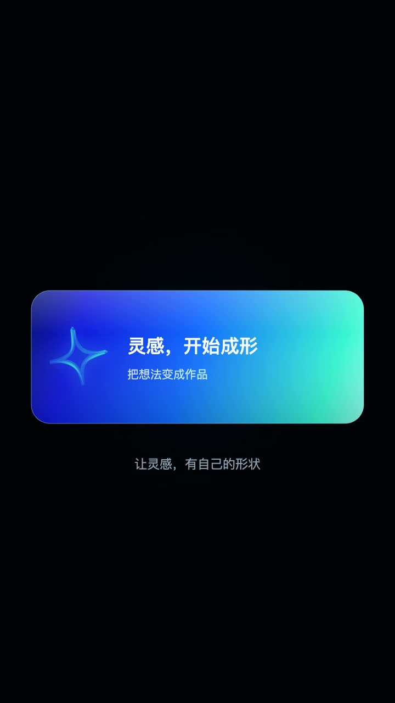
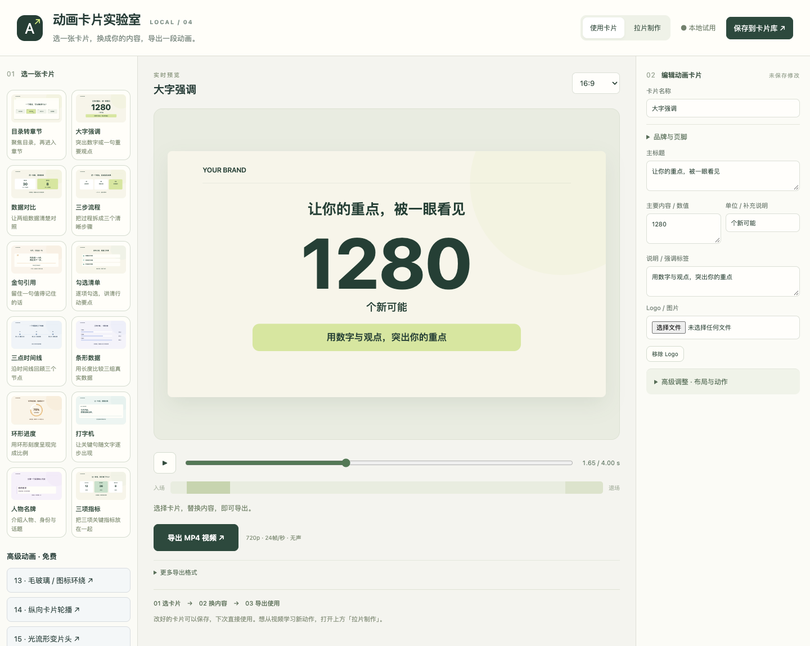

# 动画卡片实验室

**15 种免费动画模板 + 免费手工拉片。** 把文字、图片和 Logo 做成动画镜头，再放进你的剪辑流程。支持自己操作，也支持 AI agent 通过本机命令行或 HTTP 调用。

[下载免费版 v0.4](https://github.com/a148325128-max/animation-card-lab/releases/tag/v0.4.0-beta.2) · [安装与启动](开始使用.md) · [从零做一条视频](docs/完整视频制作指南.md) · [AI agent 调用](AGENT_API.md) · [反馈问题](https://github.com/a148325128-max/animation-card-lab/issues)



上图来自本项目实际导出。图标环绕使用了自行上传的 AI Logo，展示“换素材后的效果”；免费包默认使用自制抽象图案，不附带这组品牌素材。三个高级模板中，环绕包含播放器、无文字图标两种样式。

## 能做什么

| 免费模板 | 适合的镜头 | 可以改什么 |
|---|---|---|
| 毛玻璃 / 图标环绕 | 工具集合、人物或产品的动态展示 | 六条卡片文字、六个图标、中央图片、方向、速度、玻璃质感和画幅 |
| 纵向卡片轮播 | 案例、产品、作品集的连续展示 | 三张图片、可选标题、完整轮播时长 |
| 光流形变片头 | 视频开场、主题亮相 | 主标题、副标题、强调色、时长和文字开关 |
| 12种基础卡片 | 数字、步骤、数据对比、金句、人物介绍 | 内容、图片、颜色、布局和动作参数 |

基础卡片包含：大字强调、数据对比、三步流程、目录转章节、金句引用、勾选清单、三点时间线、条形数据、环形进度、打字机、人物名牌、三项指标。

<details>
<summary>查看12种基础卡片的实际效果</summary>



示例中的文字、数据为演示内容，使用时请替换为自己的实际信息。

</details>

<details>
<summary>查看光流片头的三个阶段</summary>

| 光环聚合 | 四角星形变 | 标题展开 |
|---|---|---|
|  |  |  |

这是同一个动画的三个时间点，可以调整颜色、标题与总时长。

</details>

## 怎样完成一整条视频

**文案与配音 → 分镜 → 在工作台制作动画 → 剪辑拼接 → 字幕与音乐 → 导出成片。**

1. **准备内容与声音。** 写好要讲什么，录口播或准备配音，确定每段大致时长。
2. **拆分镜。** 决定哪里用片头、哪里展示图片，哪里放步骤和数据。不要为了用满模板而塞满画面。
3. **做动画镜头。** 选模板，换成自己的文字、图片、Logo，调整时长和画幅，预览后导出无声 MP4。
4. **保存可编辑参数。** 基础卡片可保存到卡片库；高级动画请下载参数 JSON，方便下次换内容复用。
5. **完成剪辑。** 在你使用的剪辑软件中，把动画、口播、实拍或录屏排到时间线上，再加字幕、音乐与封面。
6. **检查并导出整片。** 对齐讲解和画面，检查字幕、音量、图片来源与内容准确性，再导出最终视频。

工作台目前负责**动画片段制作和手工拉片**。配音生成、整片自动编排、字幕、配乐与完整视频合成尚未集成；导出的 MP4 无声、有背景，不是透明视频。

[查看完整操作教程、45秒分镜示例和agent提示词 →](docs/完整视频制作指南.md)

## 安装后从哪里开始



1. 从上方 Release 下载 ZIP，解压到固定文件夹。不要在压缩包里直接运行。
2. 准备 Python3.10+、FFmpeg/ffprobe 和现代浏览器。双击 `打开动画卡片实验室.command`，或在包目录执行 `python3 scripts/open-lab.py`。
3. 左侧选择基础卡片；下面“高级动画 · 免费”进入三种高级模板；顶部“拉片制作”进行视频选段和抽帧。
4. 当前为本机工作台，启动器显示的地址只在你自己的电脑可用；不需要 AI 账号或 API 密钥。

高级动画与 agent 直接渲染 MP4 另需 Node.js20+ 和 Playwright1.62.1。在包目录运行：

```sh
python3 scripts/setup-advanced.py
```

脚本检查 Node，将组件安装在本目录 `.runtime`，优先使用现有 Chrome，否则下载 Chromium；需要网络，不改全局 npm 环境。页面会显示是否就绪。基础12卡的原网页导出无需 Node。

更多说明：[开始使用.md](开始使用.md) · [依赖说明](DEPENDENCIES.md) · [智能体安装规则](AGENTS.md)

## 免费拉片怎么用

导入本地 MP4/MOV/WebM（≤250MB）→ 选择≤12秒片段 → 抽取15帧 → 观察并记录元素、运动、大小和颜色变化 → 手工选模板试做。

当前不会自动识别图层、恢复原作者代码或自动生成任意新动画。AI agent可以利用抽帧结果辅助分析，但需要该agent自己具备相应能力。

## 让其他 AI agent 帮你制作

具备本机命令执行或 HTTP 能力的 agent 可以调用，不限定某一家工具：

```sh
python3 scripts/agent-cli.py templates
python3 scripts/agent-cli.py environment
python3 scripts/agent-cli.py render gradient --params gradient.json --wait
```

`gradient.json` 示例：

```json
{"title":"我的创作工作台","subtitle":"让想法动起来","duration":8,"accent":"#39f6d2"}
```

接口支持列出15模板、读取默认参数、传参渲染、查询结果、上传视频和抽帧。必须等任务 `done` 并核对成片，不能把提交成功说成渲染成功。详见 [AGENT_API.md](AGENT_API.md)。当前是本机 CLI/HTTP，不是远程 MCP 服务。

## 使用规则与当前范围

源码公开，允许免费使用；禁止修改程序源码和二次出售。**这不是标准开源许可。** 正常修改文字、图片、Logo、颜色和动画参数，以及制作、发布和商业使用成片均获允许。具体以 [LICENSE.md](LICENSE.md) 为准，第三方依赖见 [THIRD_PARTY_NOTICES.md](THIRD_PARTY_NOTICES.md)。

- 基础卡片网页导出横/竖720p、24fps；高级与agent导出30fps。环绕有3:4/9:16/16:9，轮播和光流当前为720×1280。
- 高级模板参数与基础卡片库分开保存。原素材、参数与成片请各自留存。
- 当前已完成同一台 Mac 的清洁解压、真实 UI/CLI 渲染与拉片测试；未完成其他电脑或 Windows/Linux 验收。
- 参考原片、私人素材、用户卡库、运行缓存和第三方运行时不进入分发包。README 中的效果图仅展示实际自制输出，来源说明见 [图集说明](docs/gallery/README.md)。
